# start with sbt

```
sbt run
```

# start with docker

```
sbt docker:publishLocal
```

```
docker run -p 5005:5005 -p 8080:8080 -p 7091:7091  --rm fun-jmc:0.1 
```

# verify the server is working

```
curl http://localhost:8080/hello
> <h1>Say hello to akka-http</h1>
```

# try!

## connect IntelliJ debugger

```
sbt run
```

1. select `jvm debug`
2. run `Debug`. click Bug icon

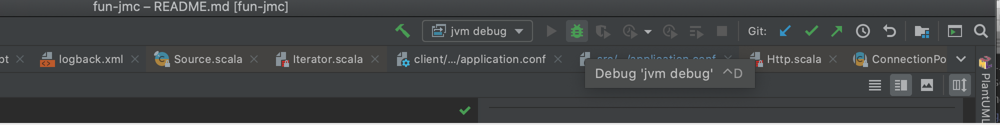

3. wait until debug console will be same as image

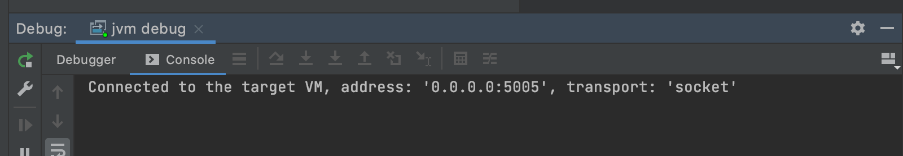

4. add break point

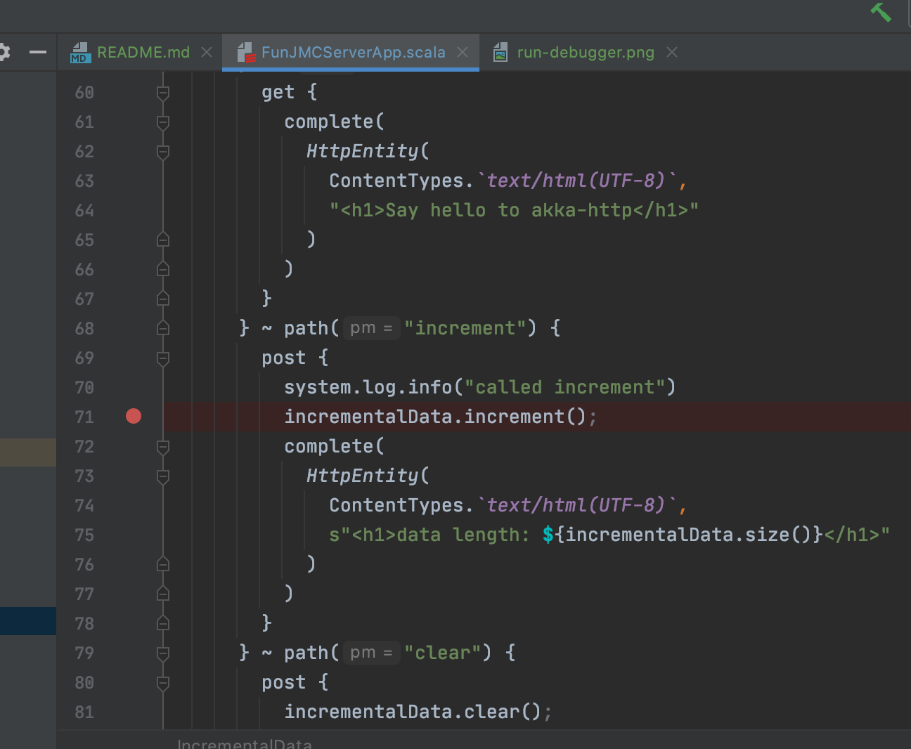

5. sent request!

```
curl -X POST  http://localhost:8080/increment
```

6. application stop in break point.


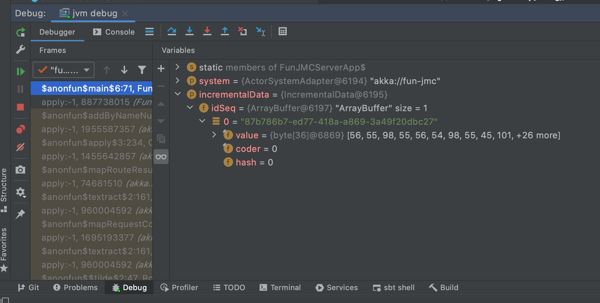

7. you can view variables. step in code. step over code.

8. introduce step over, step in.

## use IntelliJ Profiler

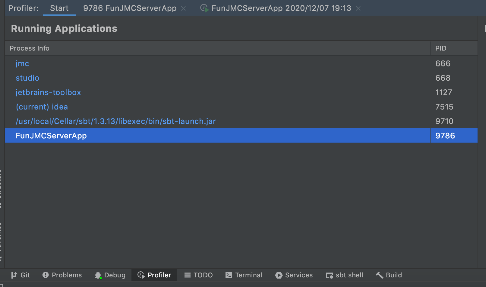

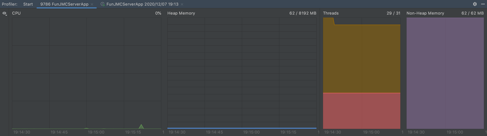

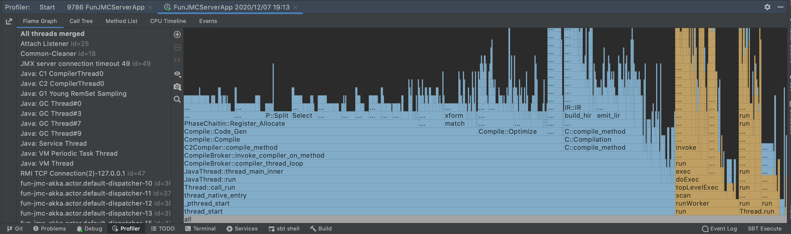


## connect JMC

```
sbt run
```

1. open JMC

2. click to 「ファイル」->「接続」

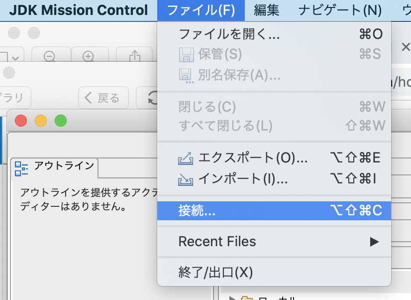

3. create connection. port & host should be same as application's jmc configuration.

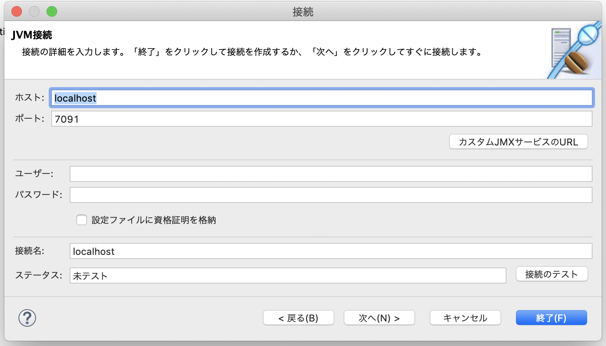

4. select created connection, and you can see dashboard.

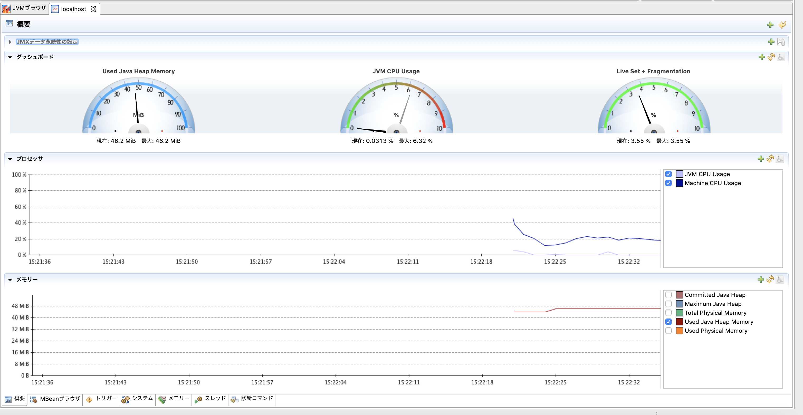

## Flight Recorder

### Run From JMC

1. when clicked 「終了」. start recording.


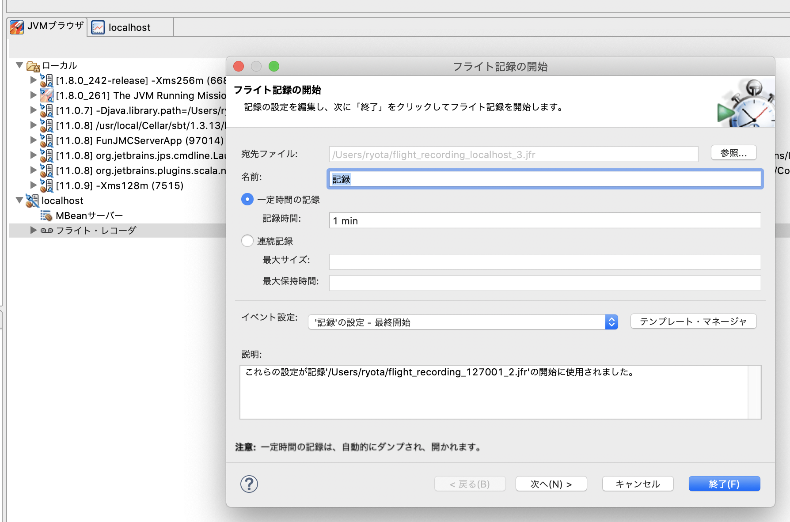

2. when the set time has passed, or open recorded profiles

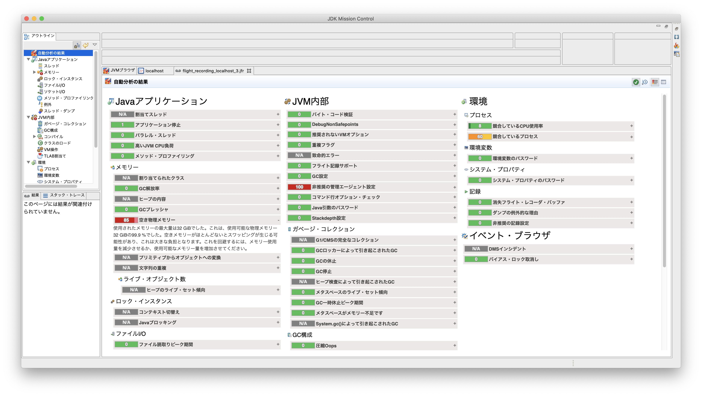

3. default recoding configuration don't record object in memory.

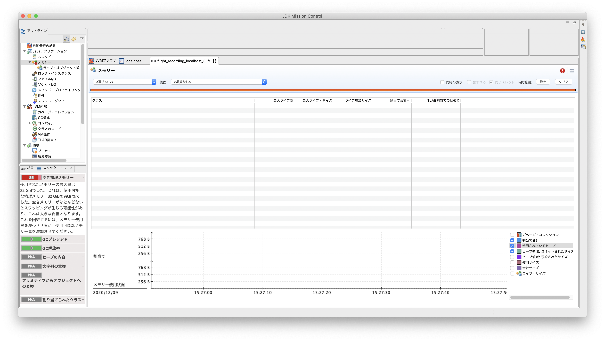

4. retry start recording, and change 「イベント設定」 

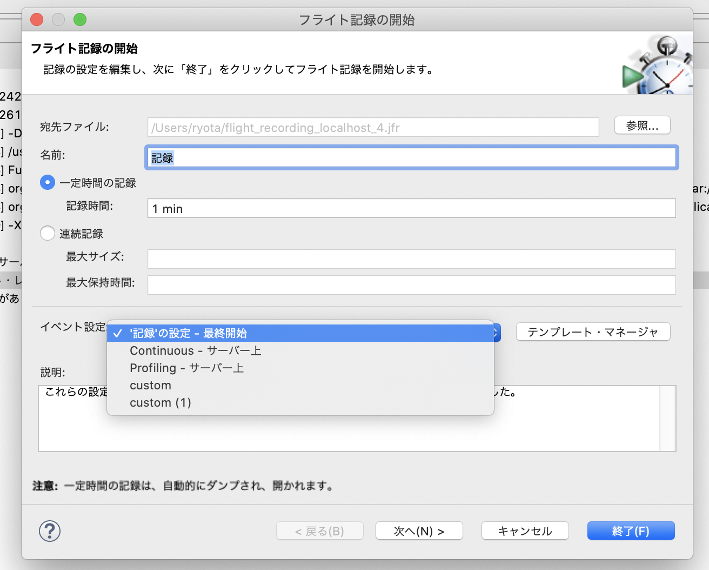

5. if you want to more customise. 「テンプレート・マネージャ」

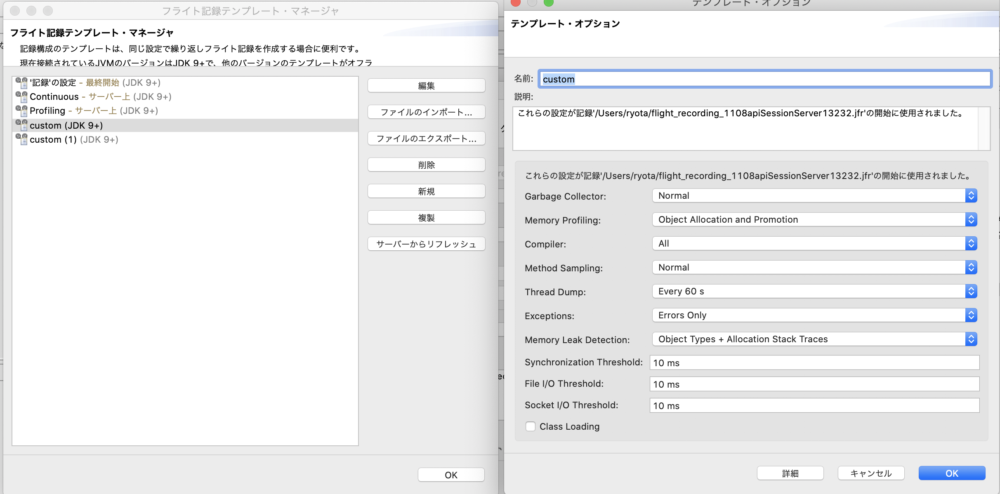

6. you can see more information!

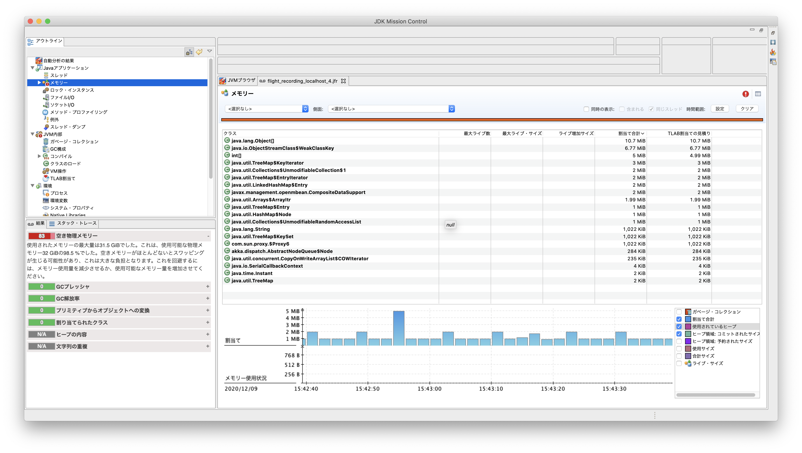


### Run From Command Line

1. check your application pid.

[jcmd](https://docs.oracle.com/en/java/javase/11/tools/jcmd.html#GUID-59153599-875E-447D-8D98-0078A5778F05)

```
jcmd
```

```
jcmd | grep FunJMCServerApp 
```

2. exec jcmd to FunJMCServerApp

```
jcmd $FunJMCServerApp_PID 
```

return too many option names

you can run operation by name

ex.
```
jcmd $FunJMCServerApp_PID VM.version
> 
```

3. start recording from jcmd

```
jcmd $FunJMCServerApp_PID JFR.start duration=60s filename=./record_$(date "+%Y%m%d_%H%M").jfr
```

add setting

```
jcmd $FunJMCServerApp_PID JFR.start duration=60s filename=./record_$(date "+%Y%m%d_%H%M").jfr settings=$JAVA_HOME/lib/jfr/profile.jfc
```

4. when the set time has passed, or `.jfr` file be fulfilled!

5. open `.jfr` file by JMC, and you can see results.
